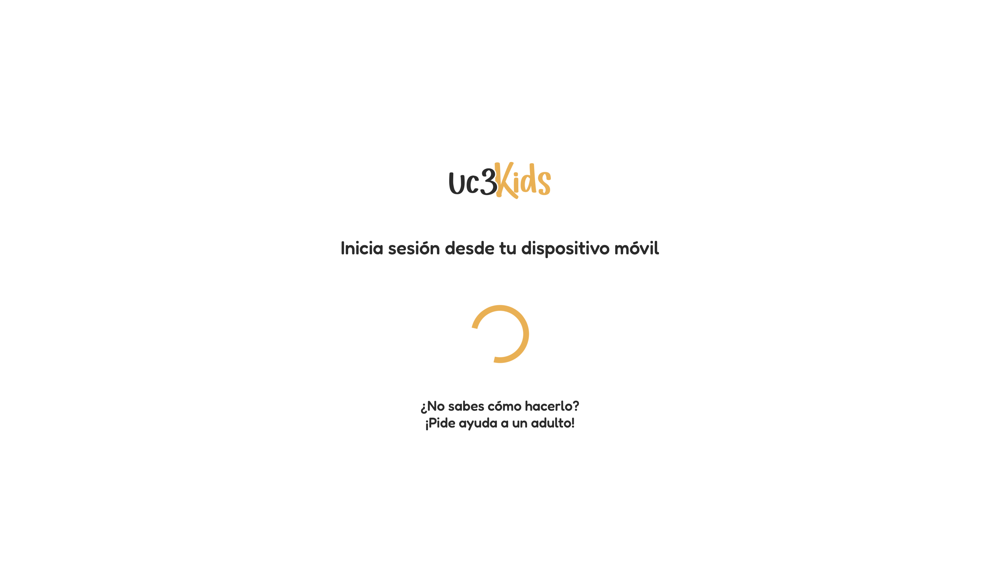
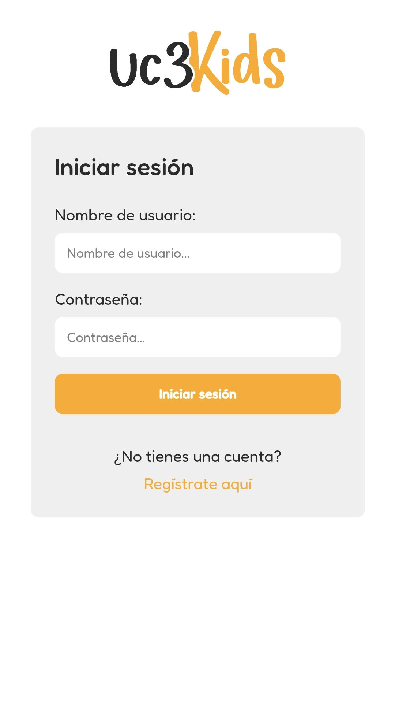
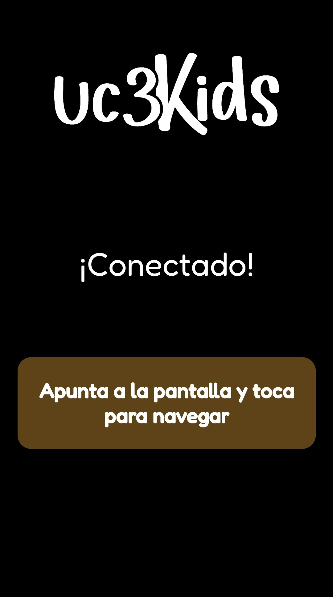
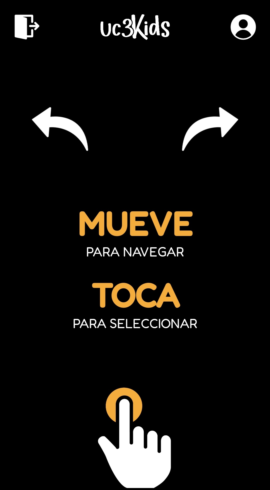
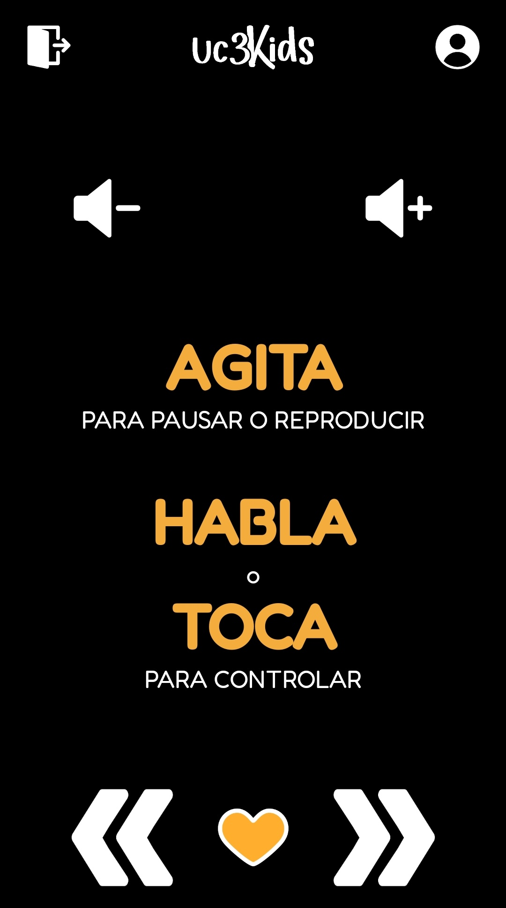
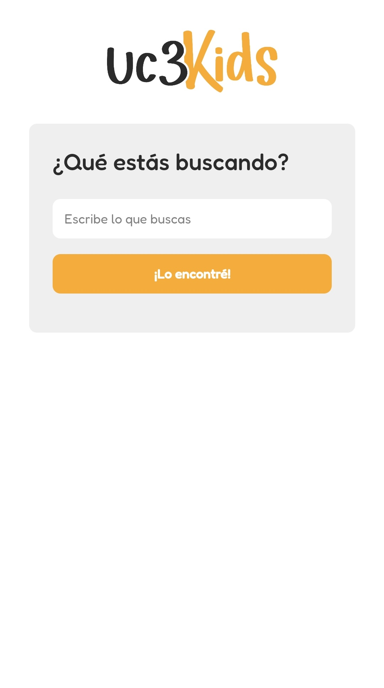

# 
uc3Kids es una plataforma de video en streaming especialmente creada para niños. Ofrece una amplia selección de contenido infantil, incluyendo películas, programas de televisión, dibujos animados y mucho más. Con esta aplicación, los niños pueden tener el control total sobre lo que quieren ver y cómo lo quieren ver, directamente desde su smartphone.

La aplicación web, basada en Node.js y utilizando diversas tecnologías web como JavaScript, HTML y CSS, y módulos como Socket.io, está diseñada para proporcionar a los niños una forma sencilla de controlar un sitio web de streaming de video bajo demanda. Con ella, los niños pueden disfrutar de su contenido favorito sin tener que pedir ayuda a sus padres para hacer uso del control remoto del televisor.

El objetivo de la aplicación es ofrecer una forma diferente de controlar el contenido que aparece en pantalla. Esto se consigue mediante el uso de gestos con el dispositivo móvil, que se comunican con la aplicación a través de un servidor Node.js. De esta forma, los niños pueden navegar por los menús, seleccionar el contenido que desean ver y controlar la reproducción de los vídeos, todo ello sin necesidad de utilizar el control remoto del televisor. Además de los gestos, la aplicación también ofrece la posibilidad de controlar la reproducción mediante comandos de voz, lo que permite a los niños controlar la reproducción de los vídeos sin necesidad de utilizar las manos.

<p>










</p>

# Contenido
- [Instrucciones de ejecución](#instrucciones-de-ejecución)
- [Funcionalidades](#funcionalidades)
- [Advertencias](#advertencias)
- [Autores](#autores)

# Instrucciones de ejecución
1. Clona o descarga este repositorio en tu máquina local.
2. Asegúrate de tener Node.js instalado en tu sistema.
3. Instala las dependencias del proyecto ejecutando el comando
``` bash
npm install
```
4. Iniciar el servidor en la terminal:
```bash
node index.js
```
5. Conectar el móvil por USB y habilitar el port forwarding en el **puerto 3000**.
6. Acceder a ``localhost:3000`` desde un navegador.
7. Hacer click en la pantalla para evitar fallos con la seguridad del navegador posteriormente.
8. Escanear el código QR que aparece en pantalla con un dispositivo móvil.
9. Seguir las instrucciones que aparecen en pantalla.

# Funcionalidades
- Redirección entre páginas y paso de datos mediante sockets.
- Registro e inicio de sesión.
- Almacenamiento de registros e información de usuarios en archivo JSON.
- Gestos con el controlador para navegación en los menús.
- Protección en extremos del controlador para evitar falsos toques.
- Toque en el controlador para selección en los menús.
- Menús personalizados de favoritos, series y películas.
- Opción de control parental mediante contraseña para restricción de contenidos desde el menú.
- Opción de buscador de contenidos desde el menú.
- Opción de salir de la aplicación desde el menú.
- Opción de usuario para mostrar datos del usuario desde el menú.
- Control por voz durante la reproducción.
- Agitar el controlador durante la reproducción para pausar/reproducir.
- Toque en las flechas en el controlador durante la reproducción para adelantar/atrasar.
- Toque en los botones de volumen en el controlador durante la reproducción para subir o bajar el volumen.
- Toque en el corazón en el controlador durante la reproducción para añadir a favoritos.
- Los favoritos se almacenan en el JSON para cada usuario.

# Advertencias
- No modificar el archivo contenido.json
- No modificar el archivo usuarios.json
- Existen los siguientes usuarios pre-registrados por si se desea usarlos.
    - Usuario: admin
        - Contraseña: admin
    - Usuario: Diego
        - Contraseña: 12345
- Mantener el dispositivo en el mismo lugar durante la navegación con gestos.
    - Hemos detectado que dependiendo de diversos factores, la orientación inicial del dispositivo influye mucho en la sensibilidad de los gestos.
    - Si se detecta que los gestos no funcionan correctamente, se recomienda recargar la pantalla del movil y establecer una posición inicial clara, ya que si se pierde la referncia de la misma o no se inicia de la manera más recta y equilibrada posible puede dar problemas.
    - Los gestos son con la muñeca, partiendo de la posición inicial, se mueve la muñeca hacia arriba, abajo, izquierda o derecha.
    - Mantener el móvil con la pantalla hacia arriba.
- Los controles por voz disponibles durante la reproducción son:
    - REPRODUCIR: reproducir, seguir, continuar, sigue
    - PAUSAR: parar, pausar, pausa, párate, para
    - SUBIR VOLUMEN: subir volumen, subir, sube, más volumen
    - BAJAR VOLUMEN: bajar volumen, bajar, baja, menos volumen
    - ADELANTAR: adelantar, adelante
    - ATRASAR: atrasar, atrás
- Ejecutar contenidos desde los menús preferiblemente al slider.

# Autores
- [Raúl Manzanero López-Aguado](https://github.com/RaulMLA)
- [Álvaro Molina García](https://github.com/)
- [Adrián Sánchez del Cerro](https://github.com/adrisdc)
